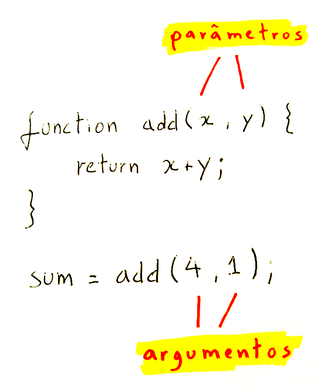
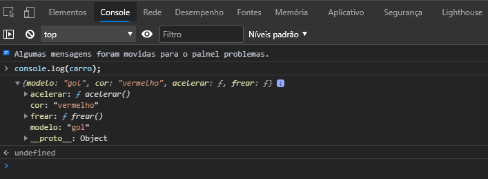
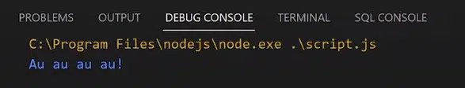

# Fundamentos básicos da programação

## Variavéis:
As variáveis são usadas com nomes simbólicos para valores em sua aplicação.
São chamados de identificadores as variaveis.
O identificador Js deve começar com uma letra, underline ou cifrão.

## Var:

Declara uma variável, pode se utilizar um valor para iniciar.

## Let:

Declara uma variável local de escopo de bloco, pode se adicionar um valor para iniciar.

## Const:

Declara uma constante de escopo de bloco (apenas leitura).

## Tipos de dados em programação

Integer (Inteiros)
Integers são números inteiros positivos ou negativos, eles podem ser especificados em diferentes tamanhos, dependendo da quantidade de memória necessária para armazená-los. São usados para contar quantidades, como o número de itens em um estoque, quantidade de votos em uma eleição, número de alunos em uma classe etc.

Float (Ponto Flutuante)
Floats são números com casas decimais e são usados para representar números reais, como preços de produtos, orçamentos, altura, temperatura etc.

Character (Caracteres)
Characters são usados para representar caracteres alfabéticos ou símbolos especiais, ou seja, qualquer coisa que você consegue digitar em um teclado. Eles podem ser usados para armazenar nomes de usuário, endereços de e-mail, senhas, sinais de pontuação etc.

String (Cadeia de caracteres)
Strings são usadas para armazenar textos mais longos, e cada caractere dentro de uma string é armazenado como um character separado na memória. Alguns exemplos de strings são mensagens de texto em aplicativos de bate-papo, posts em redes sociais, títulos de artigos etc.

Boolean (Booleanos)
Booleans podem ter apenas um de dois valores: true (verdadeiro) ou false (falso). Eles são usados para representar condições como se um usuário está conectado ou não, se um valor é maior ou menor que outro valor etc.

Arrays (Séries)
Arrays são usados para armazenar uma coleção de valores do mesmo tipo. Eles podem ser unidimensionais (uma única linha de valores) ou multidimensionais (matrizes de valores organizados em várias dimensões). São úteis, por exemplo, para armazenar uma lista de produtos em um carrinho de compras, uma lista de alunos em uma turma ou uma matriz de notas de um aluno em várias matérias.

## Operadores

Operadores Aritméticos ( +, -, *, /, **, % )
Os operadores aritméticos executam operações matemáticas, como adição e subtração com operandos. Há dois tipos de operadores matemáticos: unário e binário. Os operadores unários executam uma ação com um único operando. Operadores binários executam ações com dois operandos.

Operadores Aritméticos Unários
Operadores unários são operadores aritméticos que desempenham uma ação em um único operando. A linguagem de script reconhece o negativo do operador unário (-).
O operador unário negativo inverte o sinal de uma expressão de positivo para negativo ou vice-versa. O efeito geral é de multiplicar o número por -1. 

Exemplo:

a = -10;

Os operadores Prefix incrementam ou decrementam a variável antes de remover a referência ao objeto, enquanto que os operadores Postfix incrementam ou decrementam a variável após fazer referência a ela. Exemplo:

A=1; 
B = a++; // b será igual a 1, a será igual a 2; 
A = 1; 
B = ++a; // b será igual a 2, a será igual a 2; 
A= 1; 
B = a--; // b será igual a 1, a será igual a 0;

Operador de Designação (=)
Utilize o operador de designação (=) para copiar uma constante, um literal, um resultado de expressão de variável ou um resultado de função para uma variável. A linguagem de script não suporta várias designações em uma única instrução (como a=b=c=0). Os comprimentos das cadeias são definidos com base no tamanho da cadeia designada para a variável e pode mudar dinamicamente no tempo de execução.

Operadores Lógicos (E, OU)
Os operadores lógicos permitem a combinação de mais de um teste relacional em uma comparação. Os operadores lógicos retornam um valor TRUE (1) ou FALSE (0). Os operadores lógicos têm precedência inferior aos operadores aritméticos.
Relacionais

Operadores Significados:

==	Igualdade
!=	Desigualdade
< <=  Menor / Menor ou igual
> >=  Maior / Maior ou igual

Lógicos

Operadores	Significado
!	Negação (NOT)
&&	E (AND)
||	OU (OR)

Uma string é uma seqüência de caracteres delimitada por aspas (“) ou plics(‘). Para juntar duas strings numa única, existe o operador de concatenação representado pelo símbolo +.

Por exemplo:

nome = "Ricardo"; sobrenome = "Silva";
nomeCompleto= nome + " " + sobrenome; // nomeCompleto recebe "Ricardo Silva"

Operadores podem ser utilizados em conjunto com variáveis e valores constantes no que chamamos de expressões. Da mesma forma que com expressões matemáticas, podemos usar perentesis para definir a ordem de precedência em que as operações devem ser realizadas.

Por exemplo:

var radianos = graus * 3.1416 / 180.0;

var media = (a + b + c + d) / 4;

## Switch

Devemos utilizar quando queremos comparar a mesma variável ou expressão com várias opções:

A instrução switch é similar a uma série de instruções IF sobre a mesma expressão. Em muitas ocasiões, você pode querer comparar a mesma variável (ou expressão) com muitos valores diferentes, executando uma peça diferente do código dependendo de qual valor ele se encaixar. Este é exatamente o que a instrução switch faz.

switch($a) {
    case 1: {
        echo 'Variável A é igual a 1';
        break;
    }
    case 2: {
        echo 'Variável A é igual a 2';
        break;
    }
    default: {
        echo 'A Variável A não é igual a 1 nem igual a 2';
    }
}

## If

Devemos utilizar quando queremos realizar uma série de verificações distintas.

A construção if é uma das características mais importantes de muitas línguas, PHP incluir. Ela permite a execução condicional de fragmentos de código.

Exemplo no Ideone.

if ($a > $b) {
    echo "A é maior que B";
}
else if ($a < $b) {
    echo "A é menor que B";
}
else if ($a == $b) {
    echo "A é igual a B";
}
else {
    echo "A é alguma coisa não comparável com B";
}

## For

Executa o loop enquanto a condição for verdadeira, porém você pode instanciar as variaveis contadoras dentro da estrutura do loop.

for($contar = 1; $contar <= 10; $contar++){
    echo "$contar";
}

## While

Executa o loop enquanto a condição for verdadeira.

// Contar de 1 até 10
$contar = 1;
while($contar <= 10){
   echo "$contar";
   $contar++;
}

## Do While

Executa o loop primeiro e depois verifica a condição.

// Contar de 1 até 10
$contar = 0;
do{
    $contar++;
    echo "$contar";
}while($contar <= 10)

## Funções

Funções são blocos de construção fundamentais em JavaScript. Uma função é um procedimento de JavaScript - um conjunto de instruções que executa uma tarefa ou calcula um valor. Para usar uma função, você deve defini-la em algum lugar no escopo do qual você quiser chamá-la.

Funções em Javascript são conhecidas como objetos de primeira classe (first-class objects). Isso porque tudo o que você pode fazer com um objeto, você pode fazer com funções. Na realidade uma função é um objeto do tipo Function.

Sendo assim, as funções em Javascript podem ser:

Criadas de forma literal
function myFunction(){} //definindo uma função

Passadas como parâmetros para outras funções
function myFunction(param){} //definindo a função

//invocando a função e passando como parâmetro outra função
myFunction(function(){ console.log("função como parâmetro") })

1. Funções Declaradas
As funções declaradas são definidas usando a palavra-chave `function` seguida por um nome e parâmetros. Elas têm um formato assim:

function saudacao(nome) {
  return "Olá, " + nome + "!";
}
Nesse exemplo, “saudacao” é o nome da função, e ela recebe um parâmetro chamado “nome”. Quando chamamos a função `saudacao("João")`, ela retorna "Olá, João!".

2. Funções Expressas
Atribui-se as funções expressas a variáveis e podem ser anônimas (sem nome) ou nomeadas. Por exemplo:

const saudacao = function(nome) {
  return "Olá, " + nome + "!";
};
Aqui, a função é armazenada na variável `saudacao`. Você pode chamá-la da mesma forma que a função declarada: `saudacao("Maria")`.

Para usar uma função, você precisa chamá-la e fornecer os argumentos necessários. Por exemplo:

const resultado = somar(5, 3); // Chamada da função com dois argumentos: 5 e 3

## Parâmetros de função

Em JavaScript, parâmetros padrões de funções são undefined. No entanto, em algumas situações pode ser útil definir um valor padrão diferente. Isto é onde os parâmetros padrão podem ajudar.

Padrão

Com parâmetros padrão, a verificação no corpo da função não é mais necessária. Agora você pode simplesmente colocar 1 como valor padrão para b no campo de declaração de parâmetros:

function multiplicar(a, b = 1) {
  return a * b;
}

multiplicar(5); // 5

Parâmetros rest

A sintaxe de parâmetro rest permite representar um número indefinido de argumentos como um array. No exemplo, usamos parâmetros rest para coletar argumentos do segundo argumento ao último. Então os multiplicamos pelo primeiro argumento. Neste exemplo é usado uma arrow function, que será introduzida na próxima seção.

function multiplicar(multiplicador, ...args) {
  return args.map((x) => multiplicador * x);
}

var arr = multiplicar(2, 1, 2, 3);
console.log(arr); // [2, 4, 6]

Funções de seta
Uma expressão função de seta (anteriormente conhecida como função de seta gorda) tem uma sintaxe pequena em comparação com a expressão de função e lexicalmente vincula o valor this. Funções de seta são sempre anônimas. 
Dois fatores influenciaram a introdução de funções de seta: funções mais curtas e o léxico this.

Funções curtas
Em alguns padrões funcionais, funções curtas são bem-vindas. Compare:

var a = ["Hydrogen", "Helium", "Lithium", "Beryllium"];

var a2 = a.map(function (s) {
  return s.length;
});

var a3 = a.map((s) => s.length);

Léxico this
Até as funções de seta, cada nova função definia seu próprio valor this (um novo objeto no caso de um construtor, indefinido em chamadas de função no modo estrito, o objeto de contexto se a função é chamada como um "método de objeto", etc.). Isso pode ser irritante com um estilo de programação orientada a objetos.

function Pessoa() {
  // O construtor Pessoa() define 'this' como sendo ele.
  this.idade = 0;
  setInterval(function crescer() {
    // No modo não estrito, a função crescer define 'this'
    // como o objeto global, o que é diferente do 'this'
    // definido pelo construtor Pessoa().
    this.idade++;
  }, 1000);
}
var p = new Pessoa();

Funções de seta capturam o valor this do contexto delimitado, então o código a seguir funciona conforme o esperado.

function Pessoa(){
  this.idade = 0;

  setInterval(() => {
    this.idade++; // propriedade |this|refere ao objeto pessoa
  }, 1000);
}

var p = new Pessoa();

Funções pré-definidas
JavaScript tem várias funções pré-definidas:

eval()
O método eval() avalia código JavaScript representado como uma string.

uneval() Non-standard
O método uneval() cria uma representação de string do código-fonte de um Object.

isFinite()
A função global isFinite() determina se o valor passado é um número finito. Se necessário, o parâmetro é primeiro convertido para um número.

isNaN()
A função isNaN() determina se um valor é NaN ou não. Nota: coerção dentro da função isNaN tem regras interessantes; você pode, alternativamente, querer usar Number.isNaN(), como definido no ECMAScript 6, ou você pode usar typeof para determinar se o valor não é um número.

parseFloat()
A função parseFloat() analisa um argumento do tipo string e retorna um número de ponto flutuante.

parseInt()
A função parseInt() analisa um argumento do tipo string e retorna um inteiro da base especificada (base do sistema numérico).

decodeURI()
A função decodeURI() decodifica uma Uniform Resource Identifier (URI) criada anteriormente por encodeURI ou por uma rotina similar.

decodeURIComponent()
O método decodeURIComponent() decodifica um componente Uniform Resource Identifier (URI) criado anteriormente por encodeURIComponent ou por uma rotina similar.

encodeURI()
O método encodeURI() codifica um Uniform Resource Identifier (URI), substituindo cada ocorrência de determinados caracteres por um, dois, três, ou quatro sequências de escape que representa a codificação UTF-8 do caractere (só serão quatro sequências de escape para caracteres compostos de dois caracteres "substitutos").

encodeURIComponent()
O método encodeURIComponent() codifica um componente Uniform Resource Identifier (URI), substituindo cada ocorrência de determinados caracteres por um, dois, três, ou quatro sequências de escape que representa a codificação UTF-8 do caractere (só serão quatro sequências de escape para caracteres compostos de dois caracteres "substitutos").

escape() Deprecated
O método obsoleto escape() calcula uma nova string na qual certos caracteres foram substituídos por uma sequência de escape hexadecimal. Use encodeURI ou encodeURIComponent em vez disso.

unescape() Deprecated
O método obsoleto unescape() calcula uma nova string na qual sequências de escape hexadecimais são substituídas pelo caractere que ela representa. As sequências de escape podem ser introduzidas por uma função como escape. Por unescape() estar obsoleto, use decodeURI() ou decodeURIComponent ao invés dele.

## Argumento

Um argumento é um valor (primitivo ou um objeto) passado como um input (entrada) para uma função.

## Diferença entre parâmetro e argumento 

Parâmetro é a variável que irá receber um valor em uma função (ou método) enquanto que um argumento é o valor (que pode originar de uma variável ou expressão) que você passa para a função (ou método).

Você não passa parâmetros, você passa argumentos. Você recebe argumentos também, mas recebe em parâmetros. Você parametriza sua função com informações que virão posteriormente. Você argumenta com o que deseja executar uma função devidamente parametrizada.

Pode haver menos os mais argumentos para cada parâmetro já que existem parâmetros que são opcionais e outros que podem ser listas variáveis de dados. Portanto não há uma relação de um para um e a distinção entre eles é importante.

## Retorno de função

Valores de retorno são exatamente como soam — valores retornados pela função quando são concluídos.

## Usando valores de retorno em suas próprias funções

Para retornar um valor de uma função personalizada, você precisa usar ... aguarde por isso ... a palavra-chave return. 

## Invocando funções

Provavelmente você já tem conhecimento sobre iso agora, mas... para realmente usar uma função depois dela ter sido definida, você tem que rodá-la — ou invocá-la. Isso é feito ao se incluir o nome da função em algum lugar do código, seguido por parênteses.

function myFunction() {
  alert("hello");
}

myFunction();
// Chama a função um vez

## Funções anônimas

Você viu funções definidas e invocadas de maneiras ligeiramente diferentes. Até agora nós só criamos funções como esta:

JS
Copy to Clipboard
function myFunction() {
  alert("hello");
}

Mas você também pode criar funções que não tem nome:

JS
Copy to Clipboard
function() {
  alert('hello');
}

## Objetos e Arrays

O array é um objeto no JavaScript, ele nos auxilia pois podemos utilizar uma única variável para armazenar uma lista de diferentes elementos.

## O que são arrays em JavaScript?

O array é um objeto no JavaScript, ele nos auxilia pois podemos utilizar uma única variável para armazenar uma lista de diferentes elementos.

Por exemplo, imagine que seja necessário armazenar os nomes de todos os alunos de uma sala de aula, criar uma variável para cada aluno seria, no mínimo, trabalhoso, dependendo do tamanho dos dados eu diria inviável.

Nesta ideia podemos então criar a variável alunos e com isso armazenar o nome de todos os alunos.

Como declarar um array no JavaScript?
Para utilizar os Arrays precisamos declarar uma variável (você pode acessar o nosso artigo conhecendo variáveis e constantes no JavaScript para saber como declarar variáveis).

E ao atribuir um valor, vamos colocar entre [] e separar cada um por ,. Por exemplo:

let alunos = ['Wesley', 'Marina', 'Bruno', 'Paula'];
var series = ['Game of Thrones', 'Friends', 'Vikings'];

## Como utilizar objetos no JavaScript

Nós utilizamos objetos para agrupar valores que possuem propriedades e funções, podemos por exemplo fazer uma analogia aos objetos do mundo real. Um carro que possui cor e marca, ele também realiza ações como acelerar e frear.

Para declarar um objeto a sintaxe é bem parecida a que utilizamos para declarar arrays, porém trocamos os [] por {}. Onda as chaves, valores e funções são declaradas entre {}, conforme abaixo:

let carro = {
		modelo: 'gol',
		cor: 'vermelho',
		acelerar(){
			console.log('Acelerando...');
		},
		frear(){
			console.log('Freando');
		},
};

Neste caso declaramos o objeto literal carro, que possui duas propriedades, modelo e cor, que podem ser chamadas de chaves. Declaramos também duas funções, acelerar e frear, que podem ser chamadas de métodos. Vale ressaltar que nós podemos declarar de outras formas as funções: acelerar: function () {}ou utilizando uma arrow function, acelerar: () => {}.

Após declarar nosso objeto, podemos executar um cosole.log(carro); para visualizar como é apresentado:

## Como acessar as propriedades ou funções de um Objeto?

Para acessar uma propriedade ou uma função basta utilizarmos o nome do objeto seguido da propriedade/função separada por ponto. Por exemplo:

console.log(carro.modelo);
console.log(carro.acelerar);
carro.acelerar();

Utilizamos a função console.log, para exibir os dados acessados no console, importante lembrar que para executar a função acelerar não podemos esquecer dos ().

## O que são Métodos em JavaScript?

Os métodos são blocos de código em JavaScript que executam ações e funções específicas de um objeto. Para essa aula, é importante revisar os conceitos aprendidos sobre objetos e funções.

const zeus = {
    nome: 'Zeus',
    raca: 'Vira-Lata',
    idade: 7,
}
Quando criamos um objeto, como o nosso “cachorro” neste caso, definimos não apenas suas características, mas também suas capacidades e as ações que ele pode executar.

const zeus = {
    nome: 'Zeus',
    raca: 'Vira-Lata',
    idade: 7,
    latir: function (){
        console.log('Au au au au!');
    },
}

Podemos criar uma função anônima dentro do nosso objeto porque ela está associada a um campo específico dentro dele. No nosso exemplo, a função está associada ao campo latir do objeto zeus.

Isso significa que se executarmos o código:

const zeus = {
    nome: 'Zeus',
    raca: 'Vira-Lata',
    idade: 7,
    latir: function (){
        console.log('Au au au au!');
    },
}

zeus.latir();

 

Nesse caso, nossa função foi executada a partir do objeto zeus. Quando uma função está contida dentro de um objeto, associada a um campo dele, chamamos de método. Ou seja, latir() será um método do objeto zeus.

Portanto, a sintaxe seria: declaramos primeiro o objeto, seguido de ponto (.) e então o nome do método.

## map() - Executa uma função em todos os itens de um array

O método map() retorna um novo array após a manipulação, ou seja, não sobrescreve o array original. Na realidade, todos os métodos que iremos aprender neste artigo retornam um novo array como resposta.

Além disso, o método map() tem uma melhor performance do que o forEach(). Vamos ver um exemplo em que usar o map() nos permite realizar uma alteração nos dados de maneira bem simples.

## filter() - Filtra um array

O próximo método que iremos falar é o filter(). Como o próprio nome diz, ele tem o objetivo de filtrar as informações de um array. Sua funcionalidade consiste em informarmos para ele uma condição. Ele irá aplicar essa condição em todos os itens de nosso array e aqueles que se enquadrarem na condição serão retornados e adicionados ao novo array de saída. Dessa forma, diferente do que ocorre no map() e no reduce(), o filter() irá retornar sempre true ou false.

## reduce() - Reduz um array em um único resultado

O método reduce() é muito interessante e pode ser usado quando desejamos realizar alguma somatória ou então quando desejamos mesclar vários arrays em um único. Ele reduz todos os valores de um array em um único resultado, baseando-se na função que informamos para ele.

Os dois primeiros parâmetros desse método são muito importantes. O primeiro representa o resultado final da redução do array. Esse valor é incrementado ao longo do processo do reduce(), a cada volta desse laço de repetição.

## Promise

O objeto Promise representa a eventual conclusão (ou falha) de uma operação assíncrona e seu valor resultante.
Uma Promise é um proxy para um valor não necessariamente conhecido quando a promise é criada. Ele permite que você associe manipuladores ao valor de sucesso ou motivo de falha de uma ação assíncrona. Isso permite que métodos assíncronos retornem valores como métodos síncronos: em vez de retornar imediatamente o valor final, o método assíncrono retorna uma promise para fornecer o valor em algum momento no futuro.

Uma Promise está em um destes estados:

pending: estado inicial, nem cumprido nem rejeitado.
fulfilled: significa que a operação foi concluída com sucesso.
rejected: significa que a operação falhou.

Promises têm um método chamado .then(), que recebe uma função callback e retorna um "objeto-promessa". Não é um retorno dos dados, é a promessa do retorno destes dados.

Resolvendo várias promessas
No caso de várias promessas que devem ser resolvidas pelo programa (por exemplo, alguns dados em endpoints REST diferentes), pode-se utilizar Promise.all:

const endpoints = [
 "https://api.com/api/user/1",
 "https://api.com/api/user/2",
 "https://api.com/api/user/3",
 "https://api.com/api/user/4"
]

const promises = endpoints.map(url => fetch(url).then(res => res.json()))

Promise.all(promises)
 .then(body => console.log(body.name))

 Existem algumas formas de se trabalhar com processamento assíncrono (ou seja, Promises) em JavaScript: utilizando o método .then(), as palavras-chave async e await ou o objeto Promise e seus métodos. Aqui, vamos focar no uso de .then(), async/await e no uso do método Promise.all.

## Async/await

As palavras-chave async e await, implementadas a partir do ES2017, são uma sintaxe que simplifica a programação assíncrona, facilitando o fluxo de escrita e leitura do código; assim é possível escrever código que funciona de forma assíncrona, porém é lido e estruturado de forma síncrona. O async/await também trabalha com o código assíncrono baseado em Promises, porém esconde as promessas para que a leitura e a escrita seja mais fluídas.

Definindo uma função como async, podemos utilizar a palavra-chave await antes de qualquer expressão que retorne uma promessa. Dessa forma, a execução da função externa (a função async) será pausada até que a Promise seja resolvida.

A palavra-chave await recebe uma Promise e a transforma em um valor de retorno (ou lança uma exceção em caso de erro). Quando utilizamos await, o JavaScript vai aguardar até que a Promise finalize. Se for finalizada com sucesso (o termo utilizado é fulfilled), o valor obtido é retornado. Se a Promise for rejeitada (o termo utilizado é rejected), é retornado o erro lançado pela exceção.

Um exemplo:

let response = await fetch(`https://api.com/api/user/${userId}`);
let userData = await response.json();

Só é possível usar await em funções declaradas com a palavra-chave async, então vamos adicioná-la:

async function getUser(userId) {
 let response = await fetch(`https://api.com/api/user/${userId}`);
 let userData = await response.json();
 return userData.name; // nas linhas de return não é necessário usar await
}
Uma função declarada como async significa que o valor de retorno da função será, "por baixo dos panos", uma Promise. Se a Promise se resolver normalmente, o objeto-Promise retornará o valor. Caso lance uma exceção, podemos usar o try/catch como estamos acostumados em programas síncronos.

Para executar a função getUser(), já que ela retorna uma Promise, pode-se usar await:

exibeDadosUser(await getUser(1))
Lembrando que await só funciona se estiver dentro de outra função async. Caso não esteja, você ainda pode usar .then() normalmente:

getUser(1).then(exibeDadosUser).catch(reject)

## O que é o DOM?

O Document Object Model (DOM) é uma interface de programação para os documentos HTML e XML. Representa a página de forma que os programas possam alterar a estrutura do documento, alterar o estilo e conteúdo. O DOM representa o documento com nós e objetos, dessa forma, as linguagens de programação podem se conectar à página.

Uma página da Web é um documento. Este documento pode ser exibido na janela do navegador ou como a fonte HTML. Mas é o mesmo documento nos dois casos. O DOM (Document Object Model) representa o mesmo documento para que possa ser manipulado. O DOM é uma representação orientada a objetos da página da web, que pode ser modificada com uma linguagem de script como JavaScript.

## O que são eventos?

Os eventos são basicamente um conjunto de ações que são realizadas em um determinado elemento da página web, seja ele um texto, uma imagem, ou uma div, por exemplo. Muitas das interações do usuário que está visitando sua página com o conteúdo do seu site podem ser consideradas eventos.

Existe uma infinidade de eventos definidos para uso em JavaScript, abaixo podemos ver alguns dos principais e mais utilizados:

onBlur	remove o foco do elemento
onChange	muda o valor do elemento
onClick	o elemento é clicado pelo usuário
onFocus	o elemento é focado
onKeyPress	o usuário pressiona uma tecla sobre o elemento
onLoad	carrega o elemento por completo
onMouseOver	define ação quando o usuário passa o mouse sobre o elemento
onMouseOut	define ação quando o usuário retira o mouse sobre o elemento
onSubmit	define ação ao enviar um formulário

## Como adicionar e remover classes de elementos HTML com Vanilla JS

Usando a API classList
Além de ser compatível com muitos browsers, ela é muito fácil de aplicar. É só declarar o elemento e chamar a lista de classes:

HTML-----

JS-------
document.getElementById('id').classList;

Esse código retornará o seguinte objeto:

{
  1: "essas",
  2: "sao",
  3: "varias",
  4: "classes",
}
E você pode, então, trabalhar esse objeto utilizando os métodos da API:

add() — Adiciona uma classe
remove() — Remove uma classe
contains() — Retorna um booleano indicando se o elemento contém ou não a classe indicada.
toggle() — Adiciona ou remove a classe indicada, dependendo se ela existe ou não no elemento.
Existem outros métodos, mas vamos focar apenas nos que fazem sentido para adicionar ou remover classes de elementos HTML.

Utilizando os métodos da API
Só o que você precisa fazer é selecionar o elemento e usar o método, como no exemplo:

document.getElementById('elemento'); // Retorna o elemento
---> 

document.getElementById('elemento').classList.add('classe'); // Adiciona classe
---> 

document.getElementById('elemento').classList.remove('classe'); // Remove classe
---> 

document.getElementById('elemento').classList.toggle('classe'); // Faz toggle na classe
---> 

## Armazenamento 

LocalStorage é também chamado de Web Storage ou Armazenamento local. localStorage é um objeto JavaScript que usamos para armazenar dados no navegador. Ele fornece métodos para armazenar e recuperar a informação. O uso da API é bem simples, é baseada em chave-valor.

Método setItem
Esse é o método que usamos para armazenar valores. Sempre devemos passar uma chave como referência. No exemplo abaixo usei nome e idade como chaves.

window.localStorage.setItem(‘nome’, ‘Marta Silva Rocha’);
window.localStorage.setItem(‘idade’, 28);
Caso use o mesmo código acima, trocando apenas o nome “Marta Silva Rocha” e a idade “28” os dados anteriormente gravados serão sobre escritos, já que as chaves “nome” e “idade” permanecem as mesmas

Método getItem
Para resgatar o valor armazenado anteriormente utilizamos o método getItem. Usei o comando console.log para imprimir no console os dados resgatados, veja o exemplo

var nome = window.localStorage.getItem(‘nome’);
var idade = window.localStorage.getItem(‘idade’);
console.log(nome); // Marta Silva Rocha
console.log(idade); // 28

Agora o melhor mesmo é usar JSON para trabalhar com armazenamento local, assim podemos trabalhar com objetos. E outro detalhe, o tipo padrão de armazenamento é String. Isso deve ser considerado se você pretende usar os dados para fazer alguma operação matemática, por exemplo. Com JSON você foge dessa dificuldade com os métodos JSON.stringify e JSON.parse.

var usuario = { nome: "John Smith da Silva", idade: 29 };
window.localStorage.setItem('usuario', JSON.stringify(usuario));
Para recuperar o valor armazenado no objeto usamos o método parse:

var usuario = JSON.parse(window.localStorage.getItem('usuario'));
console.log(usuario.nome); // John Smith da Silva
console.log(usuario.idade); // 29

length()
Propriedade que mostra a quantidade de dados armazenados no objeto localStorage.

localStorage.length
key()
Método que mostra o nome da chave que foi armazenada na posição passada. O Exemplo abaixo iria retornar o nome da primeira chave.

localStorage.key(0)
Caso queira ver o valor que foi armazenado nessa chave pode fazer:

localStorage.getItem(localStorage.key(0))
Todas as informações salvas no localStorage só serão removidas utilizando os métodos vistos ou se o usuário limpar os dados do seu navegador. Caso contrário ele pode fechar e abrir o navegador, as informações armazenadas continuarão no navegador.

